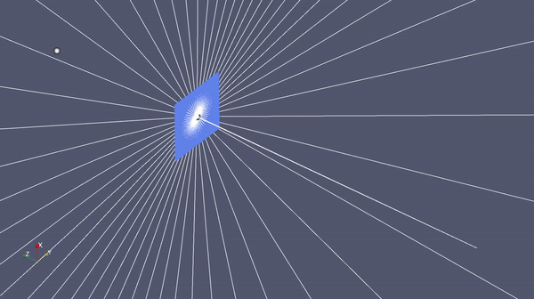
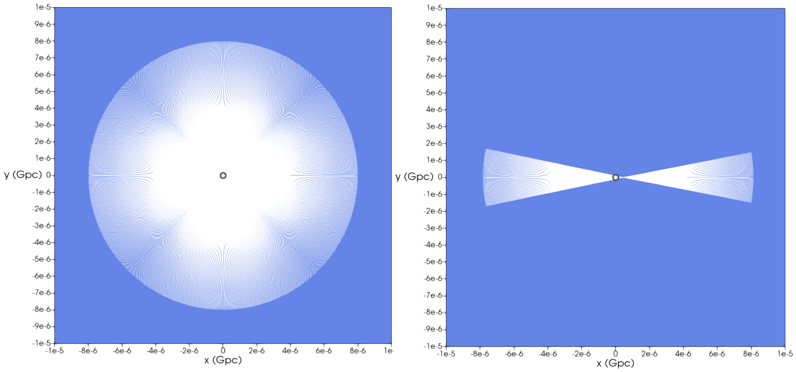
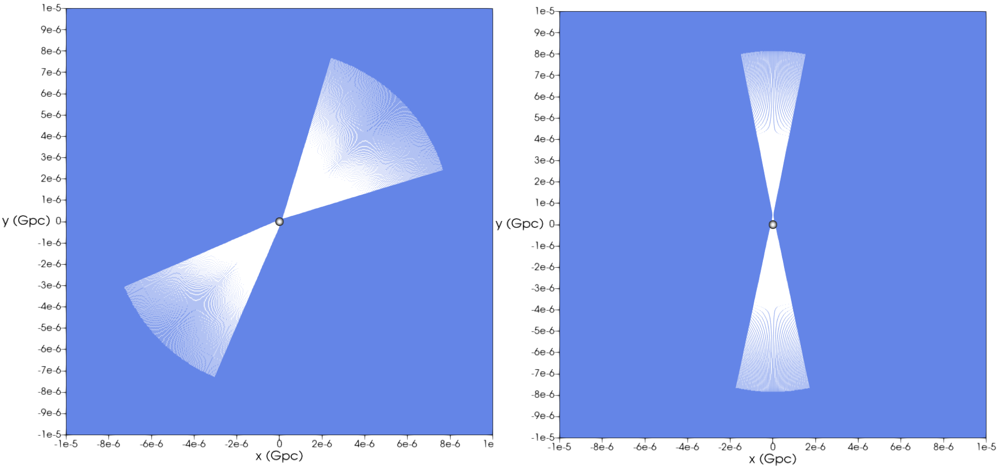

# Weak gravitational lensing
This code framework contains tools necessary to perform ray tracing for 
weak gravitational lensing scenarios.

|  |
|:--:|
*Figure 1: The animation shows the shooting of rays from the observer as cone-by-cone incrementally increasing the half angle of the cone.*
*The blue plane shows the lensing plane.*  

    
  
*Figure 2: The figures show the rays that intersect the point source for (a) perfect alignment, and shifted lens object with (b) xshift of 300 pc,
(c) yshift of 300 pc, and (d) xshift and yshift of 100 pc.*  

