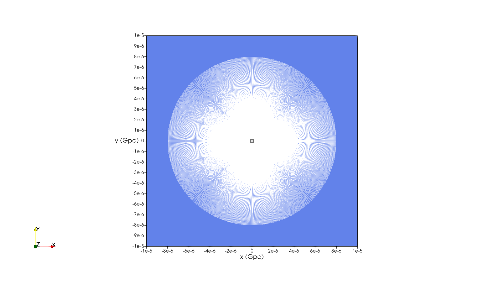

# Weak gravitational lensing
This code framework contains tools necessary to perform ray tracing for 
weak gravitational lensing scenarios.

The animation shows the shooting of rays from the observer as cone-by-cone incrementally increasing the half radius of the cone. 
The figures show the rays that intersect the point source for perfect alignment and shift of the lens object in the x and y 
directions.

